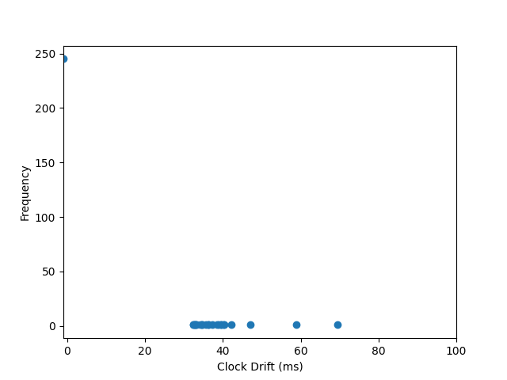

# Docker for Mac OpenNTPD Clock Drift

This repo documents clock drift experienced inside of a docker container when openNTPD is used instead of SNTPC on normal usage of Apple MacBook M1. 

## Scatter Plot
